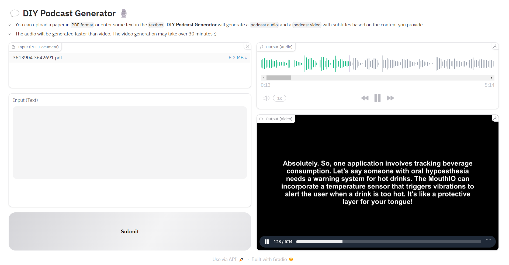

# 💬 DIY Podcast Generator 🎙️


A simple implementation of the [Google NotebookLM](https://notebooklm.google.com/) **Audio overview** function (of course, the performance of this system is somewhat inferior). But you can run 💬 **DIY Podcast Generator** on your PC, and generate a podcast video with captions. :)



## Demo

### Podcast Audio

<audio src="./demo/podcast_audio.wav"></audio>

### Podcast Video

<video src="./demo/podcast_video.mp4"></video>

## Prerequisites

- Python>=3.10

- Please make sure that your computer has [FFmpeg](https://ffmpeg.org/) and [ImageMagick](https://imagemagick.org/) installed.

- Remember to revise the file `gen_video.py` the line below to your `magick.exe` path (it should be line 15).

  ```python
  change_settings({"IMAGEMAGICK_BINARY": r"C:\Program Files\ImageMagick\magick.exe"})
  ```

- Create a new `.env` file in the root directory of this project , and add your `OPENAI API key`.

  ```
  OPENAI_API_KEY = "sk-xxxxxxxxxxxxxxxxxxxxx"
  ```

## Installation

1. Clone the repository:

   ```sh
   git clone https://github.com/BlackThompson/DIY_Podcast_Generator.git
   cd DIY_Podcast_Generator
   ```

2. Install the required packages:
   ```sh
   pip install -r requirements.txt
   ```

## Usage

1. Run the script:

   ```sh
   python app.py
   ```

2. Click the given URL:

   ```shell
   Running on local URL: http://127.0.0.1:xxxx
   ```

3. You can upload a PDF file (a paper suggested), or input some text, then click `submit`.

4. The audio will be generated faster than the video. The video generation may take over **30 minutes** (sorry for that slow). **Patience is key in life** XD

## Logging

The application logs its activities to `DIY_Podcast.log` with the following format:

```
%(asctime)s - %(levelname)s - %(message)s
```
